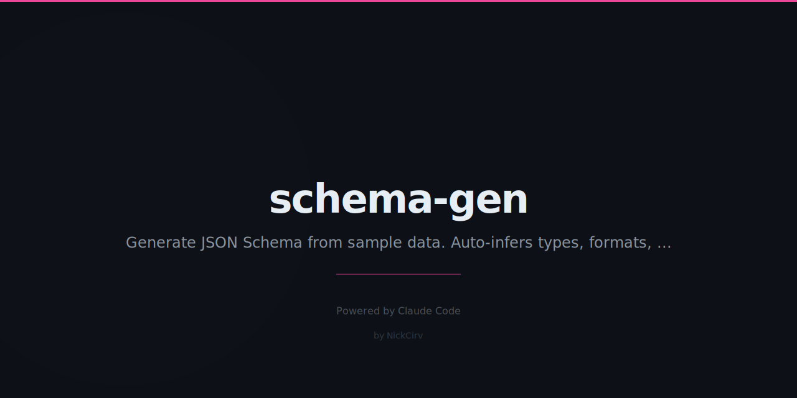

# schema-gen

Generate JSON Schema Draft-7 from sample JSON data. Infers types, required fields, formats, and constraints from real data — zero dependencies.

## Install

```bash
npm install -g schema-gen
```

Or run directly:

```bash
npx schema-gen [file]
```

## Usage

### Generate schema from JSON

```bash
# From stdin
echo '{"name":"John","email":"j@x.com","age":30}' | schema-gen

# From file
schema-gen users.json

# With options
schema-gen users.json --title "User" --strict
```

### From array of samples

When your input is an array of objects, schema-gen merges all samples. Fields present in ALL samples become required.

```bash
schema-gen users.json --from-array
```

### Validation

```bash
schema-gen validate user-schema.json john.json
```

Output:

```
✅ Valid — data matches schema
```

or:

```
❌ Invalid — 2 error(s):
  • #.email: string does not match format "email"
  • #: missing required property "age"
```

### Merge two schemas

Combines two schemas using `allOf`:

```bash
schema-gen merge base.json extended.json > combined.json
```

### Diff two schemas

Shows structural differences:

```bash
schema-gen diff v1.json v2.json
```

Output:

```
3 difference(s) found:

  Legend: (-) only in v1.json  (+) only in v2.json  (~) changed

  + #.properties.phone: {"type":"string"}
  ~ #.properties.age.type:
    < "integer"
    > "number"
  - #.required: ["name","email","age"]
```

## Options

| Flag | Description |
|------|-------------|
| `--from-array` | Treat root array as multiple samples to merge |
| `--strict` | Mark all detected fields as required |
| `--loose` | No required fields, all optional |
| `--title <title>` | Add title to generated schema |
| `--help`, `-h` | Show help |

## Type Inference

| JSON Value | Inferred Type |
|-----------|---------------|
| `"hello"` | `string` |
| `"j@x.com"` | `string` + `format: email` |
| `"2026-03-03"` | `string` + `format: date` |
| `"2026-03-03T12:00:00Z"` | `string` + `format: date-time` |
| `"https://example.com"` | `string` + `format: uri` |
| `"550e8400-..."` | `string` + `format: uuid` |
| `30` | `integer` |
| `3.14` | `number` |
| `true` / `false` | `boolean` |
| `null` | `null` |
| `{...}` | `object` (recursed) |
| `[...]` | `array` (items merged) |

## Multiple Samples

When merging multiple samples (via `--from-array` or an array of objects):

- **required**: only fields present in ALL samples
- **properties**: union of all keys across samples
- **minLength / maxLength**: min/max observed across samples
- **type**: union if samples disagree (e.g. `["string", "null"]`)

## Example Output

Input:

```json
[
  {"id": 1, "name": "Alice", "email": "alice@example.com", "role": "admin"},
  {"id": 2, "name": "Bob",   "email": "bob@example.com"}
]
```

Output:

```json
{
  "$schema": "http://json-schema.org/draft-07/schema#",
  "type": "object",
  "properties": {
    "id":    { "type": "integer" },
    "name":  { "type": "string", "minLength": 3, "maxLength": 5 },
    "email": { "type": "string", "format": "email" },
    "role":  { "type": "string", "minLength": 5, "maxLength": 5 }
  },
  "required": ["id", "name", "email"]
}
```

`role` is not required because it only appears in one sample. `id`, `name`, and `email` appear in both — they are required.

## Requirements

- Node.js 18+
- Zero npm dependencies

## License

MIT
