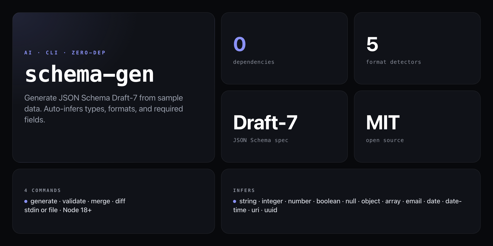

<div align="center">

**Point it at any JSON and get a valid Draft-7 schema back. Types, formats, and required fields inferred automatically.**


</div>

---

Writing JSON Schema by hand is tedious and error-prone. `schema-gen` reads your real data and produces a valid Draft-7 schema in one command — with type inference, format detection (email, date, uri, uuid), and required-field analysis from multiple samples. Then validate, merge, and diff schemas with the same tool.

```
$ echo '[
  {"id": 1, "name": "Alice", "email": "alice@example.com", "role": "admin"},
  {"id": 2, "name": "Bob",   "email": "bob@example.com"}
]' | npx github:NickCirv/schema-gen

{
  "$schema": "http://json-schema.org/draft-07/schema#",
  "type": "object",
  "properties": {
    "id":    { "type": "integer" },
    "name":  { "type": "string", "minLength": 3, "maxLength": 5 },
    "email": { "type": "string", "format": "email" },
    "role":  { "type": "string", "minLength": 5, "maxLength": 5 }
  },
  "required": ["id", "name", "email"]
}
```

`role` is absent from one sample — so it stays optional. `id`, `name`, and `email` appear in both — they become `required`.

## Install

No install needed — runs straight from GitHub with zero dependencies:

```bash
npx github:NickCirv/schema-gen
```

## Usage

```bash
# Generate schema from stdin
echo '{"name":"Alice","email":"alice@example.com","age":30}' | npx github:NickCirv/schema-gen

# Generate from a file
npx github:NickCirv/schema-gen users.json

# Merge an array of samples — required = fields present in ALL samples
npx github:NickCirv/schema-gen users.json --from-array

# Add a title, force all fields required
npx github:NickCirv/schema-gen users.json --title "User" --strict

# Validate data against a schema
npx github:NickCirv/schema-gen validate user-schema.json john.json

# Merge two schemas with allOf
npx github:NickCirv/schema-gen merge base.json extended.json > combined.json

# Show structural differences between two schemas
npx github:NickCirv/schema-gen diff v1.json v2.json
```

### Flags

| Flag | Description |
|------|-------------|
| `--from-array` | Treat root array as multiple samples to merge |
| `--strict` | Mark all detected fields as required |
| `--loose` | No required fields — all optional |
| `--title <title>` | Add a `title` to the generated schema |
| `--help`, `-h` | Show help |

## Type inference

| JSON value | Inferred type |
|-----------|---------------|
| `"hello"` | `string` |
| `"alice@example.com"` | `string` + `format: email` |
| `"2026-03-03"` | `string` + `format: date` |
| `"2026-03-03T12:00:00Z"` | `string` + `format: date-time` |
| `"https://example.com"` | `string` + `format: uri` |
| `"550e8400-..."` | `string` + `format: uuid` |
| `30` | `integer` |
| `3.14` | `number` |
| `true` / `false` | `boolean` |
| `null` | `null` |
| `{...}` | `object` (recursed) |
| `[...]` | `array` (items merged) |

Plain strings get `minLength` / `maxLength` from the observed value. When merging multiple samples, `minLength` takes the minimum and `maxLength` takes the maximum seen across all inputs.

## Validate command

```bash
npx github:NickCirv/schema-gen validate user-schema.json john.json
```

```
✅ Valid — data matches schema
```

or:

```
❌ Invalid — 2 error(s):
  • #.email: string does not match format "email"
  • #: missing required property "age"
```

Exit code is `1` on validation failure — works in CI.

## Diff command

```
$ npx github:NickCirv/schema-gen diff v1.json v2.json

3 difference(s) found:

  Legend: (-) only in v1.json  (+) only in v2.json  (~) changed

  + #.properties.phone: {"type":"string"}
  ~ #.properties.age.type:
    < "integer"
    > "number"
  - #.required: ["name","email","age"]
```

## What it is NOT

- **Not a full JSON Schema validator.** It covers the common subset — types, formats, required, properties, minLength/maxLength, minimum/maximum, allOf. Keywords like `oneOf`, `anyOf`, `if/then`, `$ref` are not supported.
- **Not a schema registry or storage tool.** It generates and validates schemas; where you store them is up to you.
- **Not a code generator.** It produces JSON Schema — feed that into your preferred validator library (ajv, zod-to-json-schema, etc.) for runtime enforcement.

---

<div align="center">
<sub>Zero dependencies · Node 18+ · JSON Schema Draft-7 · MIT · by <a href="https://github.com/NickCirv">NickCirv</a></sub>
</div>
